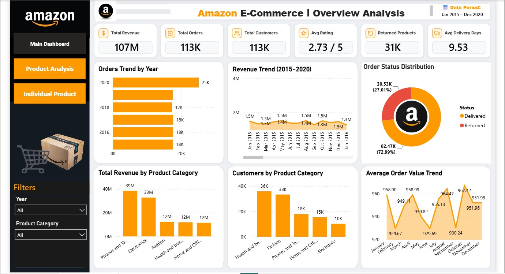
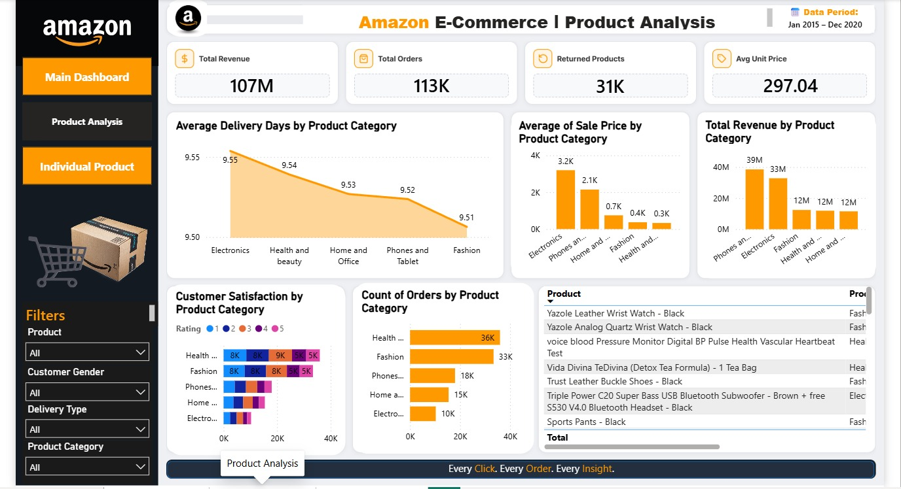
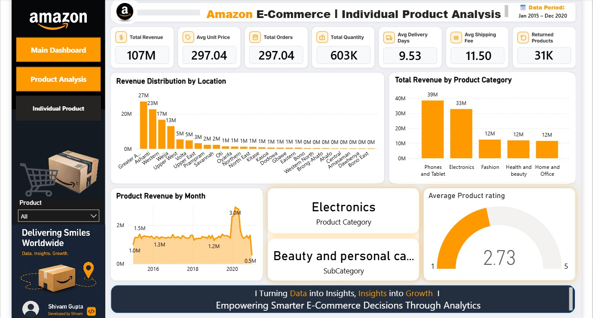

# 🛒 Amazon E-Commerce Sales Analytics Dashboard
### Power BI Capstone Project | Ghana Market (2015–2020)


---

## 📌 Project Overview

This end-to-end analytics project transforms **1,13,000 raw e-commerce orders** (2015–2020) from Ghana's Amazon market into a fully interactive 3-tab Power BI dashboard. The goal: help business stakeholders answer 35+ real questions about revenue, customers, products, returns, and regional performance — and walk away with clear, data-backed recommendations.

> *"A 27% return rate that has nothing to do with delivery speed — it's a content problem disguised as a logistics problem."*

---

## 🖥️ Live Dashboard
---

## 📸 Dashboard Preview

### Tab 1 — Main Dashboard (Executive Overview)


### Tab 2 — Product Analysis


### Tab 3 — Individual Product Deep-Dive


---

## 📊 Key Metrics (All Categories, 2015–2020)

| Metric | Value |
|---|---|
| 💰 Total Revenue | ₵107 Million |
| 📦 Total Orders | 1,13,000 |
| 👥 Total Customers | 1,13,000 |
| ⭐ Avg Customer Rating | 2.73 / 5 |
| 🔄 Returned Orders | 31K (27%) |
| 🚚 Avg Delivery Days | 9.53 days |
| 🏷️ Avg Unit Price | ₵297.04 |
| 📦 Total Quantity Sold | 603K |
| 🚢 Avg Shipping Fee | ₵11.50 |

---

## 💡 Key Business Insights

### 1. 📱 Revenue is concentrated in 2 categories
**Phones & Tablets (₵39M)** and **Electronics (₵33M)** together drive **67% of total revenue** despite having fewer customers than Health & Beauty. Health & Beauty has the most customers (36K) but contributes only ₵12M — high frequency, low ticket size.

### 2. 📦 Return rate is a listing problem, not a delivery problem
At **27% return rate**, the top reason across all categories is **"Description Mismatch"** — not late delivery, not defective products. This signals a product listing accuracy issue that marketing + operations teams need to fix together.

### 3. 📍 Greater Accra + Ashanti = 47% of all revenue
These 2 regions dominate sales (₵27M + ₵23M) while 20+ other locations contribute less than ₵1M each. Regional marketing budget is not aligned with revenue potential.

### 4. 💸 High price does not guarantee high satisfaction
Electronics has the highest average sale price (₵3.2K per order) but customer satisfaction stays moderate at 2.73/5 — suggesting fulfilment and post-purchase experience need improvement.

### 5. 📈 Order volume accelerating
Orders grew from ~18K/year (2015–18) to **25K in 2020**, with monthly revenue steady at ₵1.3–1.5M — consistent demand with clear room for growth via targeted promotions.

---

## 🏗️ Project Architecture

```
Raw Excel Data (Orders + Customers)
        ↓
Power Query Editor (Data Cleaning + Transformation)
        ↓
Data Model (Star Schema: Customers ↔ Orders ↔ Date Table)
        ↓
DAX Measures (15+ measures: Revenue, YoY, MoM, Delivery, Returns...)
        ↓
3-Tab Interactive Dashboard (Power BI Desktop)
        ↓
Published to Power BI Service (Live Interactive Link)
        ↓
SQL File (7 Advanced Queries: CTEs, Window Functions, Rolling Averages)
```

---

## 🧹 Data Cleaning (Power Query)

| Issue Found | How Fixed |
|---|---|
| 5 phantom blank columns (Col18–Col22) | Removed via Remove Columns |
| Blank rows with all null values | Home → Remove Blank Rows |
| 1 missing Product Category | Identified via SubCategory mapping → filled "Health and beauty" |
| 8 missing Unit Price + Order Quantity | Group By + Merge → fetched product-wise average price; Qty assumed = 1 |
| 1 missing Customer Gender | Labeled "Unknown" to preserve the order record |
| Data type mismatches | Dates → Date, IDs → Whole Number, Prices → Decimal Number |

---

## 📐 Data Model (Star Schema)

```
Customers (1) ──────────── Orders (Many)
[CustomerID]               [CustomerID]

Date Table (1) ──────────── Orders (Many)
[Date]                      [OrderDate]
```

- **Relationship type:** Many-to-One (Orders → Customers)
- **Schema:** Star Schema
- **Cross filter direction:** Single
- **Objective Q10 answer:** CustomerID relationship between Orders and Customers is **Many-to-One**

---

## 📋 Key DAX Measures

```dax
-- Total Revenue
Total Revenue = SUM(Orders[Sale Price])

-- Total Orders
Total Orders = COUNTROWS(Orders)

-- Avg Delivery Days (Delivered orders only)
Avg Delivery Days =
CALCULATE(
    AVERAGEX(
        Orders,
        DATEDIFF(Orders[OrderDate], Orders[Delivery Date], DAY)
    ),
    Orders[Status] = "Delivered"
)

-- Returned Products Count
Returned Products = CALCULATE(COUNTROWS(Orders), Orders[Status] = "Returned")

-- Return Rate
Return Rate = DIVIDE([Returned Products], [Total Orders], 0)

-- Fashion + Shipped from Abroad (CALCULATE + Iterator)
Fashion Abroad Sales =
CALCULATE(
    [Total Revenue],
    Orders[Product Category] = "Fashion",
    Orders[Delivery Type] = "Shipped from Abroad"
)

-- YoY Revenue (Time Intelligence)
Revenue PY =
CALCULATE([Total Revenue], SAMEPERIODLASTYEAR('Date'[Date]))

-- MoM Growth %
MoM Growth % =
VAR CurrentMonth = [Total Revenue]
VAR PrevMonth = CALCULATE([Total Revenue], DATEADD('Date'[Date], -1, MONTH))
RETURN DIVIDE(CurrentMonth - PrevMonth, PrevMonth, 0) * 100

-- YoY Comparison Table (Year, Month, Sales, Prev Year Sales)
Previous Year Sales =
CALCULATE([Total Revenue], SAMEPERIODLASTYEAR('Date'[Date]))
```

---

## 🗄️ SQL Queries (7 Advanced Questions)

📄 Full file → [`Amazon_Ecommerce_SQL_Queries.sql`](Amazon_Ecommerce_SQL_Queries.sql)

| # | Business Question | SQL Concepts Used |
|---|---|---|
| Q1 | Top 5 most valuable customers using composite score (Revenue 50% + Frequency 30% + AOV 20%) | CTE, Window Functions, Min-Max Normalization |
| Q2 | Month-over-month revenue growth rate (entire dataset) | CTE, LAG(), DATE_FORMAT() |
| Q3 | Rolling 3-month average revenue per product category | AVG() OVER with ROWS BETWEEN 2 PRECEDING |
| Q4 | Apply 15% discount for customers with ≥10 orders | UPDATE, Subquery JOIN |
| Q5 | Avg days between consecutive orders (≥5 orders) | LAG(), DATEDIFF(), CTE chain |
| Q6 | Customers with revenue >30% above average | CROSS JOIN, percentage calculation |
| Q7 | Top 3 categories with highest YoY sales increase | LAG(), YEAR(), ORDER BY growth DESC |

---

## 🎯 Dashboard Tab Guide

### Tab 1 — Main Dashboard
**POC:** Senior Leadership / Executives

| Element | Details |
|---|---|
| Slicers | Year, Product Category |
| KPI Cards | Total Revenue, Total Orders, Total Customers, Avg Rating, Returned Products, Avg Delivery Days |
| Charts | Orders Trend by Year (bar), Revenue Trend 2015-2020 (line), Revenue by Category (bar), Customers by Category (bar), AOV Trend (line), Order Status Distribution (donut) |

### Tab 2 — Product Analysis
**POC:** Category Managers / Product Team

| Element | Details |
|---|---|
| Slicers | Product, Customer Gender, Delivery Type, Product Category |
| KPI Cards | Total Revenue, Total Orders, Returned Products, Avg Unit Price |
| Charts | Avg Delivery Days by Category (area), Avg Sale Price by Category (bar), Revenue by Category (bar), Customer Satisfaction by Category (stacked bar), Count of Orders by Category (bar), Product table |

### Tab 3 — Individual Product
**POC:** Product Owners / Inventory Team

| Element | Details |
|---|---|
| Slicer | Product (search dropdown) |
| KPI Cards | Total Revenue, Avg Unit Price, Total Orders, Total Quantity, Avg Delivery Days, Avg Shipping Fee, Returned Products |
| Charts | Revenue Distribution by Location (bar), Revenue by Category (bar), Product Revenue by Month (line), Category + SubCategory card, Avg Rating gauge |

---

## 📈 Strategic Recommendations

### 1. 🥇 Customer Loyalty Program
Segment all customers into **3 tiers** using the composite score from SQL Q1:
- 🥉 **Bronze** — Bottom 60% → basic rewards, birthday discounts
- 🥈 **Silver** — Middle 30% → free shipping, early sale access
- 🥇 **Gold** — Top 10% → dedicated account manager, exclusive deals

### 2. 🏷️ Targeted Discount Strategy
Apply discounts to **high-price, low-rating products** identified via Product Analysis tab. Priority: Electronics items with rating below 2.5 — highest price, moderate satisfaction.

### 3. 📝 Reduce 27% Return Rate
Top return reason = "Description Mismatch." Immediate actions:
- Audit all product listings for accuracy
- Add size guides and detailed spec sheets
- Flag products with >30% return rate for listing review

### 4. 📍 Regional Marketing Focus
**Greater Accra (₵27M) + Ashanti (₵23M) = 47% of revenue.** Actions:
- Concentrate ad spend on Zone 1 and Zone 3
- Launch location-specific flash sales
- Offer faster delivery SLAs for top 4 regions

---

## 📂 Repository Structure

```
amazon-ghana-ecommerce-analytics/
│
├── README.md                           ← Project documentation
├── Amazon_Ecommerce_Dashboard.pbix     ← Power BI file
├── Amazon_Ecommerce_SQL_Queries.sql    ← All 7 SQL queries
├── Amazon_Project_Presentation.pptx   ← 15-slide storytelling deck
│
└── screenshots/
    ├── main_dashboard.png              ← Tab 1 screenshot
    ├── product_analysis.png            ← Tab 2 screenshot
    └── individual_product.png          ← Tab 3 screenshot
```

---

## 🛠️ Tools & Technologies

| Tool | Purpose |
|---|---|
| **Power BI Desktop** | Dashboard building, DAX measures, data modeling |
| **Power Query (M Language)** | Data cleaning and transformation |
| **DAX** | KPIs, time intelligence, calculated columns, iterators |
| **MySQL 8.0** | Advanced SQL queries (CTEs, window functions, UPDATE) |
| **Power BI Service** | Publishing and sharing live dashboard |
| **Microsoft PowerPoint** | 15-slide storytelling presentation |

---

## 👨‍💻 About the Author

**Shivam Gupta**
Data Analytics Student @ Newton School | Team Leader @ Experts of Deals, Kanpur

Transitioning from Sales & Business Development into Data Analytics, with hands-on experience in Power BI, SQL, Excel, and DAX.

[](https://linkedin.com/in/your-profile)
[](https://github.com/Shivamgupta6388)

---

## 📄 License

This project is open source and available under the [MIT License](LICENSE).

---

*⭐ If this project helped you or inspired you, please give it a star — it means a lot!*
